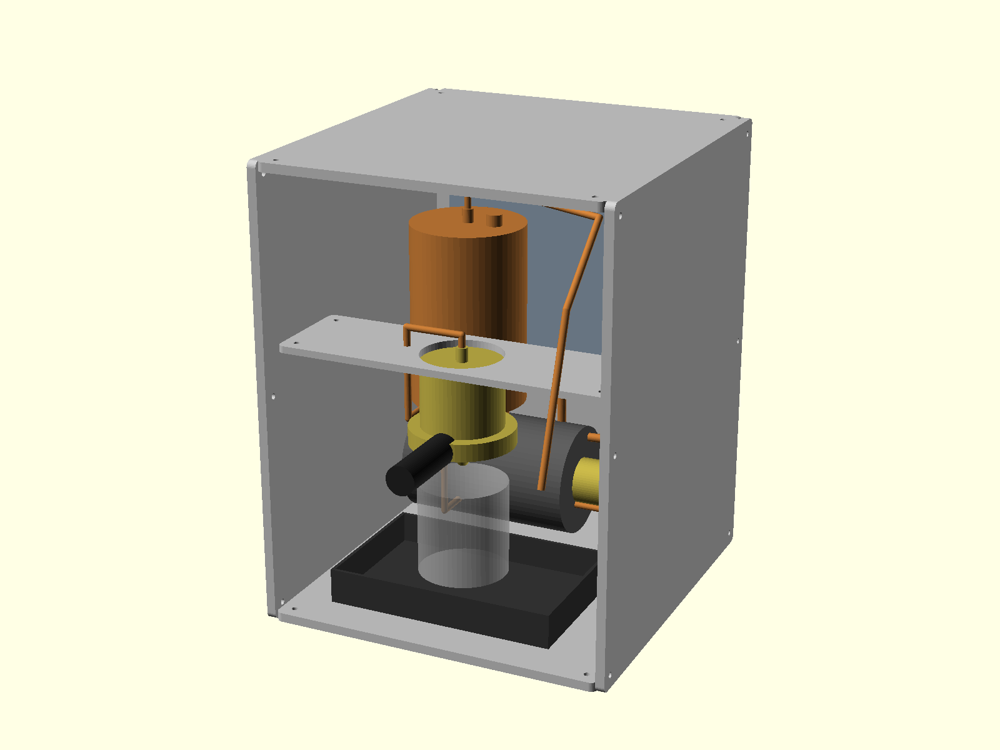

# fika

An open source DIY cappuccino machine. Minimalist and solid: an oak
slab, two aluminum rails, exposed copper pipes and lead free brass, and
an ESP32 brain running ESPHome with first-class Home Assistant support.

## Status: early concept

This project is at the earliest possible stage. No machine exists and
none has ever been built: no frame has been cut, no boiler brazed, no
wire connected. What the repository contains is a parametric layout
model, a firmware skeleton that runs under QEMU, and documents
describing the design intent. Every dimension, setpoint, cost and
claim in these files is an unvalidated estimate and may change
completely. Nothing here is a build guide, and nothing here has been
reviewed for safety. Do not build from these files.



*Layout-stage assembly: single dual-use copper boiler and 58 mm group
seated in the deck, rotary pump under it, water tank standing on the
deck, drip tray that doubles as a scale, exposed copper throughout.
Rendered by the pipeline from cad/; regenerate, never edit.*

## Philosophy

- Controls are what you already do. Put your cup on the tray: the
  machine recognizes it by weight and arms that cup's brew program.
  Flip the solid brew toggle; the shot stops itself at the target
  beverage weight. Two toggles, a lamp, a beep. No screens.
- Autonomous. Every control loop runs on the ESP32; MQTT and Home
  Assistant observe and adjust setpoints. The machine brews with the
  network cable cut.
- Nothing that does not work. There is no case: the frame is an oak
  slab, two rails and a deck, and a member exists only if it carries a
  component (concepts/open-frame.md). What is left over is copper, so
  the plumbing is routed to be looked at.
- Solid and honest. Mains, heat and pressure are handled by a
  mechanical safety chain that works with the firmware dead
  (concepts/safety-architecture.md). Pressure parts are brass and
  copper, never printed; the parts you touch are oak.
- Deterministic. One parameters file drives CAD, layout checks and
  budgets; one command regenerates every derived artifact; one
  read-only gate verifies everything and runs before every push (CI
  wiring of the same gate is on TODO).

## Design snapshot

- Single boiler, dual use: brew at 93 C, steam at 125 C (SPECS.md).
- Rotary vane pump + mains motor, OPV at 9 bar.
- 230 V / 50 Hz EU mains, 1400 W element, 10 A circuit friendly.
- Frame: 24 mm oak slab plus 10 mm 6082-T6 rails and deck, all cut on a
  PrintNC; DXF profiles are build products (outputs/dxf/).

## Control system

```
python3 tools/validate.py        # software gate (yaml, esphome, contracts)
scripts/verify_design.sh         # full read-only verify gate
python3 scripts/regen_all.py     # rebuild all derived artifacts
esphome config esphome/example-fika.yaml
```

Real-firmware simulation (no hardware needed): the actual compiled
firmware boots under Espressif QEMU and you poke sensor values from a
debug web page while watching the machine react. See docs/SIMULATION.md
and `.claude/skills/simulator`.

## Repository structure

- `cad/` - OpenSCAD models; `design_params.scad` is the single source
  of truth for every shared dimension
- `outputs/` - committed build products (STL, DXF, PNG, budgets);
  regenerated by `scripts/regen_all.py`, drift-checked by the gate
- `esphome/` - composable firmware: `fika-base.yaml` + one package per
  capability + example and simulator nodes
- `sim/` - QEMU simulator container and injection web UI
- `scripts/`, `tools/` - the pipeline and the gates
- `docs/` - contracts: PROTOCOL, HARDWARE, EXTENDING, SIMULATION
- `concepts/` - design rationale
- `SPECS.md`, `MATERIALS.md`, `TODO.md`

## How to contribute

Fork, branch, and keep the gate green: `scripts/verify_design.sh` must
pass, and anything under `outputs/` must be regenerated in the same
change that alters its sources. Machine-specific configuration belongs
in your private fika-config (docs/EXTENDING.md), not in the stock
packages.
